# **AUTOMATIZAÇÃO - EXTRAÇÃO FATURA DE INTERNET CLARO** <h1>

 

Neste processo foi usada a biblioteca **Selenium**, no qual é comumente utilizada para realizar automações web. <h2>

## **COMANDOS UTILIZADOS** <h3>  

 

- **Habilita ações de mouse**    
ActionChains(navegador)

 

- **Realiza o click**  
navegador.find_element(By.XPATH, '**Inserir XPATH**').click()

 

- **Aguarda até que um elemento apareça na página**  
WebDriverWait(navegador, **Inserir tempo limite de aguardo**).until(EC.presence_of_element_located((By.ID, "**Inserir ID**")))

 

- **Insere texto em um campo**  
navegador.find_element(By.XPATH,'**Inserir XPATH**').send_keys(**Inserir texto a ser escrito**)

 

- **Obtem texto**  
navegador.find_element(By.CSS_SELECTOR, '**Inserir elemento CSS**').get_attribute('innerHTML')

 

- **Realiza o click levando o cursor do mouse até o objeto**  
mouse.move_to_element(**Passar variável do caminho XPATH****).click().perform()

 

## **RESUMO DO PROCESSO** <h4> 

 

Inicialmente é realizado os cliques na tela principal do site da Claro para acessar a tela de conta de internet fixa:

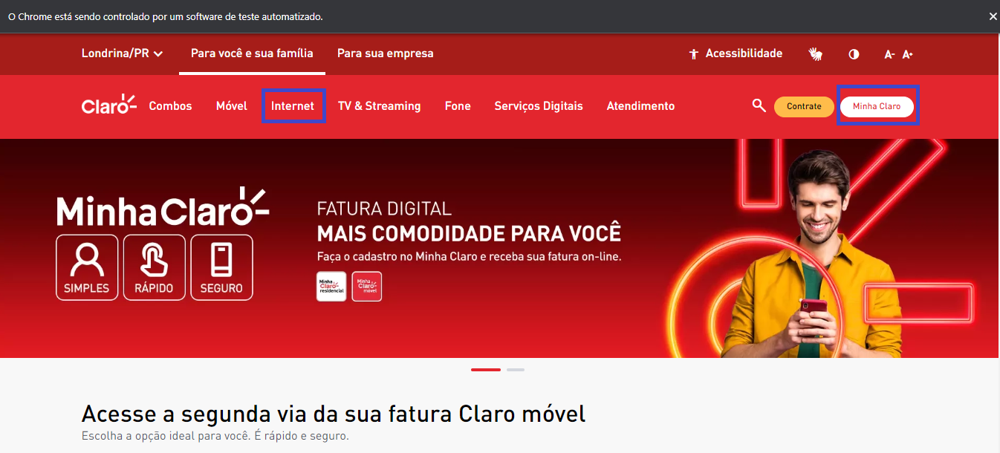

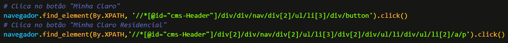

 

Após chegar na tela de login, o usuário e a senha são inseridos:

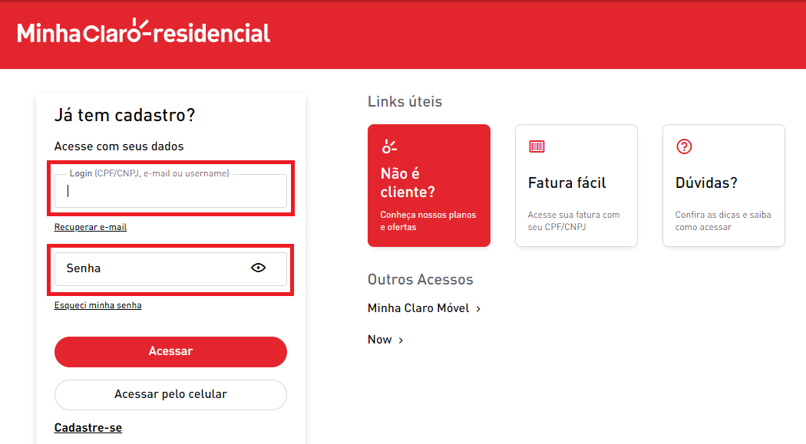

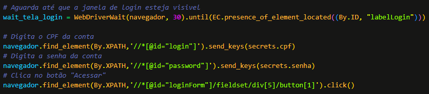

 

Após realizar o login o robô verifica qual é a conta da cidade de Londrina e seleciona:

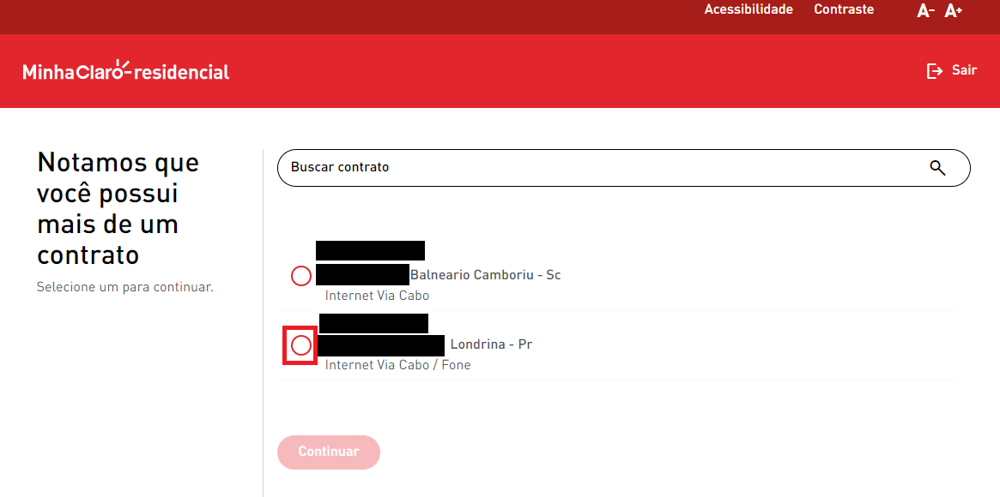

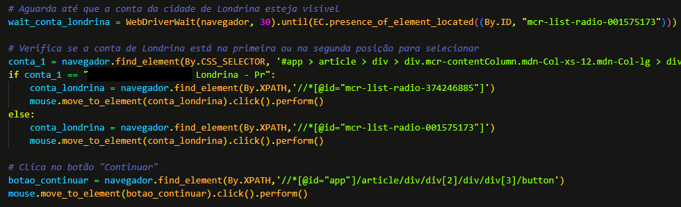

 

Após selecionar a conta da cidade correta, o robô verifica se irá aparecer uma janela de enquete, e caso apareça ela é fechada, e logo em seguida o clique no botão para acessar a página de download de fatura é efetuado:

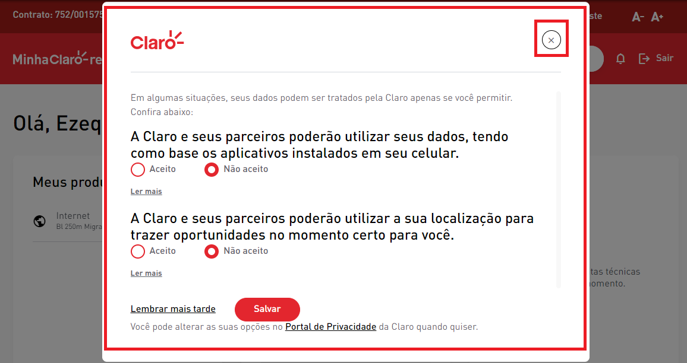

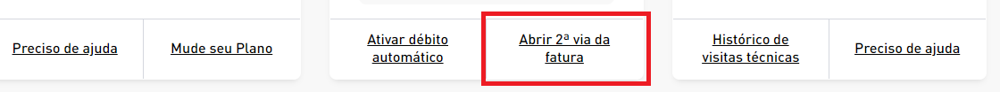

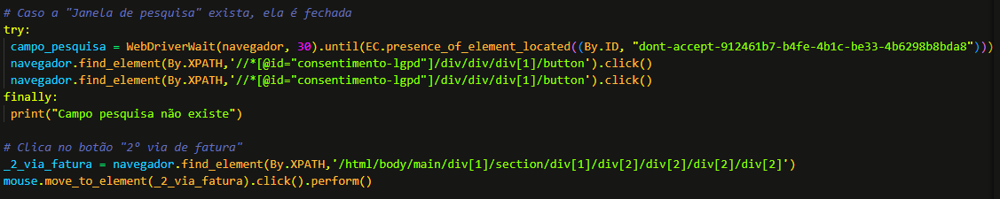

 

Em seguida, o clique para realizar o download da fatura é feito aguardando um intervalo de 10 segundos, caso surja algum erro, o clique é feito novamente, então a conta em formato pdf é finalmente baixada:

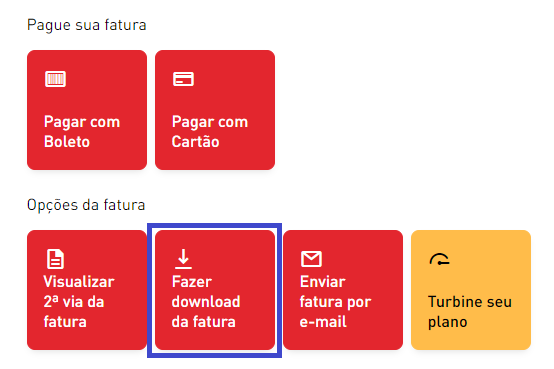

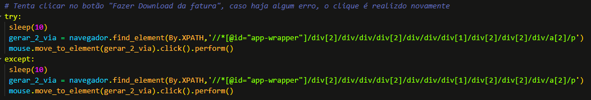

